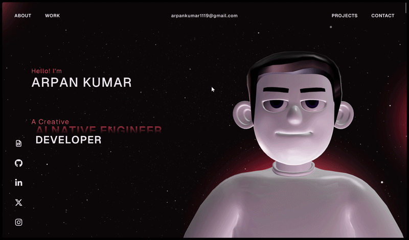
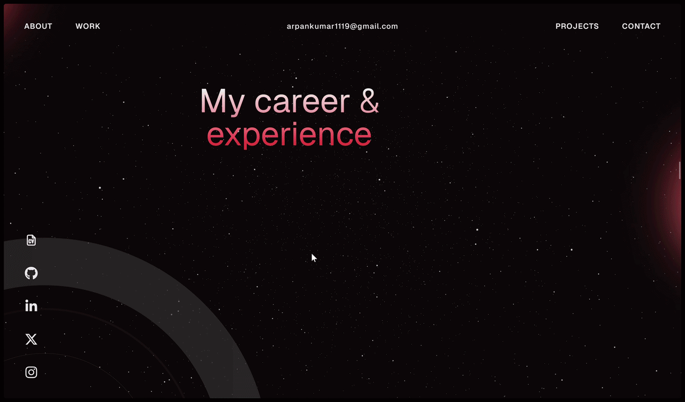
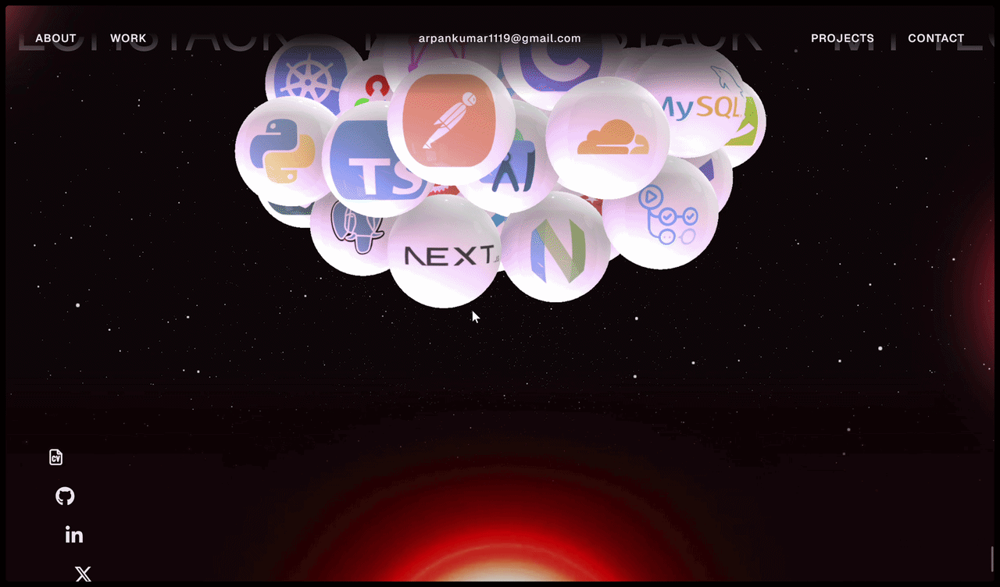

<div align="center">

# Arpan Kumar — Portfolio

A scroll-driven 3D portfolio: a character that follows you down the page, a starfield behind everything, pinned sections, a shader transition between them and a black hole in the footer.

[](https://github.com/thearpankumar/portfolio-thearpanhq.in/actions/workflows/ci.yml)
[](https://thearpanhq.in)
[](LICENSE)
[](https://github.com/thearpankumar/portfolio-thearpanhq.in/commits/main)
[](https://github.com/thearpankumar/portfolio-thearpanhq.in/graphs/commit-activity)

[](https://www.npmjs.com/package/react)

[](https://www.npmjs.com/package/vite)
[](https://www.npmjs.com/package/three)
[](https://www.npmjs.com/package/@react-three/fiber)
[](https://www.npmjs.com/package/gsap)


</div>

---
## Preview - **[thearpanhq.in](https://thearpanhq.in)**

### Preloader Section


### Intro Section


### Career Section


### Project Section


### Tech Stack Section


### Contact Section


## Highlights

- **3D character** (Three.js) that reacts to the cursor and changes pose as you scroll.
- **Smooth, pinned scrolling** with GSAP ScrollTrigger and ScrollSmoother: About and What I Do hold still while they are read, a wheel-style career timeline, a horizontal Work gallery and a statement that slides across the screen.
- **Shader transitions** (GLSL) between the career, work and tech-stack sections.
- **Physics tech stack**: 50 icon-covered spheres you can push around (react-three-fiber + cannon-es, running in a Web Worker).
- **Always-on starfield** rendered on its own canvas, independent of everything else.
- **Footer** with a looping black-hole video; the side social icons glide into it and settle in a row.
- **Handwritten preloader** ("Bonjour, mon ami !") drawn stroke by stroke on an OffscreenCanvas in a Web Worker, so it stays smooth while the page loads.
- **Resume orb**: a ring of text around the logo that spins and fans out DevOps / Cyber Security / Software Developer buttons on hover.
- Respects `prefers-reduced-motion`.

## Tech stack

| Area | Tools |
| --- | --- |
| Framework | React 19, TypeScript 7, Vite 8 |
| 3D | Three.js, @react-three/fiber, @react-three/drei, @react-three/cannon, @react-three/postprocessing |
| Animation | GSAP (ScrollTrigger, ScrollSmoother, SplitText), CSS `cos()`/`sin()` for the radial menu |
| Quality | ESLint 10 (typescript-eslint), `tsc`, `npm audit` |
| CI/CD | GitHub Actions → Vercel CLI |

## Getting started

Requires **Node 20.19+ or 22.12+** (Vite 8).

```bash
git clone https://github.com/thearpankumar/portfolio-thearpanhq.in.git
cd portfolio-thearpanhq.in
npm ci
npm run dev
```

Open the address Vite prints (usually http://localhost:5173).

### Scripts

| Command | What it does |
| --- | --- |
| `npm run dev` | Start the dev server |
| `npm run build` | Type-check (`tsc -b`) and build to `dist/` |
| `npm run preview` | Serve the production build locally |
| `npm run lint` | Run ESLint |
| `npm run typecheck` | Type-check only |
| `npm run assets:brand` | Regenerate the OG image and icons from `public/images/logo.png` |
| `npm run assets:model` | Compress (Meshopt) and re-encrypt the character model |

## License

[MIT](LICENSE) © 2026 Arpan Kumar
